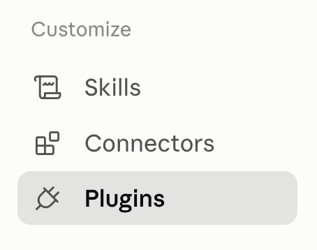

# FinalScout Plugins

Official [FinalScout](https://finalscout.com) plugin marketplace for [Claude Code](https://code.claude.com).

## Installation

Add this marketplace in Claude Code:

```
/plugin marketplace add finalscout/finalscout-plugins
```

Then install a plugin:

```
/plugin install finalscout@finalscout-plugins
```

## Using in the Claude desktop app

The desktop app doesn't support `/plugin` slash commands — install through the settings UI instead:

1. In the sidebar, click **Customize**.

   

2. Under **Customize**, select **Plugins**.

   

3. In the Plugins panel, click **Add** → **Add marketplace**.

   

4. Choose **Add from a repository**.

   

5. Enter `finalscout/finalscout-plugins` as the URL and click **Sync**.

6. Find **FinalScout Email Finder** in the plugin list and click **+** to install it.

7. The plugin now appears in your **Plugins** list.

8. Set your FinalScout API key (get one at <https://finalscout.com/app/api/settings>) as the `FINALSCOUT_API_KEY` environment variable, e.g. in `~/.claude/settings.json`:

   ```json
   {
     "env": {
       "FINALSCOUT_API_KEY": "your-api-key"
     }
   }
   ```

9. Start a new chat and ask naturally — e.g. *"find the email for this LinkedIn profile"*, *"find jane doe's email at acme.com"*, or *"how many FinalScout credits do I have left?"*.

## Available plugins

| Plugin | Description |
| --- | --- |
| [FinalScout Email Finder](https://github.com/finalscout/claudecode-plugin-b2b-contact-enrichment) | Find verified professional email addresses with the FinalScout API — by LinkedIn profile URL, full name + company domain, or news article URL. Single lookups, bulk batches with progress tracking, CSV export, webhooks, and credit checks. |

## Updating

Refresh your local copy of the marketplace at any time:

```
/plugin marketplace update finalscout-plugins
```

## License

Each plugin is licensed individually — see the plugin's repository for details.
